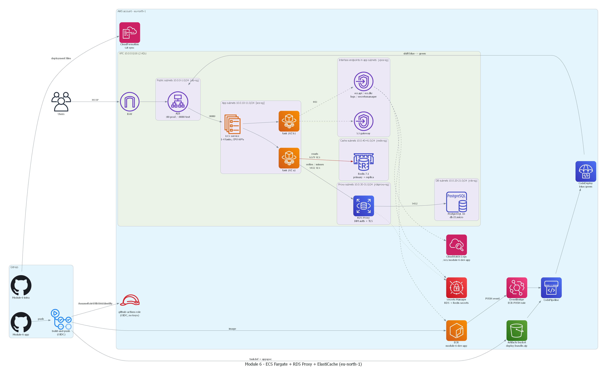

# Module 6 – Infrastructure (CloudFormation + Git sync)

Highly available, private Java task app on **ECS Fargate** in `eu-north-1`, backed by
**RDS PostgreSQL** (through **RDS Proxy**) and **ElastiCache Redis**, released with
**CodeDeploy blue/green** via **CodePipeline**, triggered by **EventBridge** on every ECR push.

Application code lives in a separate repo: **[Module-6-app](https://github.com/Michelle-anyika/Module-6-app)**.



The diagram is code: [`diagrams/architecture.py`](diagrams/architecture.py) (`pip install diagrams`, Graphviz, `python diagrams/architecture.py`).

## Stacks

| Stack | Template | Git sync deployment file | What it owns |
|---|---|---|---|
| `module-6-gitsync-bootstrap` | `bootstrap/gitsync-role.yaml` | – (one-off CLI deploy) | IAM role Git sync uses |
| `module-6-network` | `templates/network.yaml` | `deployments/network.yaml` | VPC, 10 subnets, routes, VPC endpoints, all security groups |
| `module-6-cicd` | `templates/cicd.yaml` | `deployments/cicd.yaml` | ECR repo, artifact bucket, GitHub OIDC role |
| `module-6-data` | `templates/data.yaml` | `deployments/data.yaml` | RDS PostgreSQL, RDS Proxy, ElastiCache Redis, Redis AUTH secret |
| `module-6-app` | `templates/app.yaml` | `deployments/app.yaml` | ECS cluster/service/autoscaling, ALB, CodeDeploy, CodePipeline, EventBridge |

Order: `network` → `cicd` + `data` (in parallel) → first image pushed to ECR → `app`.
Stacks share values through CloudFormation exports (`<stack>-<Name>`).

## Network design (VPC `10.0.0.0/16`, 2 AZs)

| Tier | AZ a | AZ b | Route | Security group (ingress) |
|---|---|---|---|---|
| Public (ALB) | 10.0.0.0/24 | 10.0.1.0/24 | IGW | `alb-sg`: 80, 8080 from internet |
| App (ECS tasks + interface endpoints) | 10.0.10.0/24 | 10.0.11.0/24 | local + S3 gateway | `ecs-sg`: 8080 from `alb-sg` only |
| DB (RDS) | 10.0.20.0/24 | 10.0.21.0/24 | local | `rds-sg`: 5432 from `rdsproxy-sg` only |
| Proxy (RDS Proxy) | 10.0.30.0/24 | 10.0.31.0/24 | local | `rdsproxy-sg`: 5432 from `ecs-sg` only |
| Cache (ElastiCache) | 10.0.40.0/24 | 10.0.41.0/24 | local | `redis-sg`: 6379 from `ecs-sg` only |

`vpce-sg` allows 443 from `ecs-sg` only. Egress is also restricted: ALB → ECS:8080, ECS → proxy:5432 / redis:6379 / 443,
proxy → RDS:5432, and the RDS, Redis and endpoint groups have no egress.

**No NAT gateway.** Private tasks reach AWS through VPC endpoints: `ecr.api`, `ecr.dkr`, `logs`, `secretsmanager`
(interface) and `s3` (gateway, for ECR image layers). This saves about $35/month per NAT and removes the internet egress path.

## Security decisions

- **GitHub → AWS uses OIDC only.** The `module-6-dev-github-actions` role trusts `token.actions.githubusercontent.com`,
  but only for `repo:Michelle-anyika/Module-6-app:ref:refs/heads/main`. It can push to one ECR repo and write to `deploy/*` in one bucket. No access keys exist.
- **The database password is never given to the app.** RDS manages and rotates the master secret. RDS Proxy reads it, and the proxy
  **requires IAM auth + TLS**. The task role only has `rds-db:connect` on `dbuser:<proxy-id>/module6admin`, and the app signs
  a 15-minute token with the AWS SDK (`RdsUtilities`).
- Redis: TLS in transit, encryption at rest, an AUTH token generated into Secrets Manager, injected as an ECS secret.
- RDS: encrypted gp3 storage, not public, final snapshot kept on delete. ECR: scan on push, lifecycle keeps 10 images.
  S3: private, encrypted, TLS-only bucket policy, old versions expire.
- IAM roles are scoped to named resources wherever the service allows it.

## Deployment flow

1. A push to `Module-6-app/main` starts GitHub Actions: Maven build, then `docker build`. The job assumes the OIDC role.
2. The workflow renders `ecs/taskdef.json` + `ecs/appspec.yaml` and uploads them to `s3://<artifacts>/deploy/bundle.zip`.
3. It pushes the image as `:<sha>`, then `:latest`.
4. The **EventBridge rule** `module-6-dev-ecr-push` (ECR `PUSH`, `SUCCESS`, tag `latest`) starts **CodePipeline**.
5. CodePipeline (source: ECR image + S3 bundle) → **CodeDeployToECS**. CodeDeploy starts green tasks, registers them in the
   green target group, and exposes them on the test listener `:8080`. It then moves production `:80` to green all at once, and terminates
   blue after 5 minutes. Rollback on failure is automatic.

## Operations

- **Auto scaling:** min 1 / desired 1 / max 4 tasks. Target tracking on `ECSServiceAverageCPUUtilization` = 60%.
- **Logs:** CloudWatch Logs group `/ecs/module-6-dev-app` (14-day retention).
- **Health:** the ALB target groups and the container health check both use `GET /health`.
- **Tags:** every stack is tagged `Project=module-6, Environment=dev, Owner, ManagedBy=CloudFormation, CostCenter=aws-labs`.
  CloudFormation propagates these to the resources, and ECS adds managed tags to tasks.

## Git sync setup

Git sync watches each `deployments/*.yaml` file on `main` and updates the matching stack.

```bash
# one-off: role used by Git sync
aws cloudformation deploy --stack-name module-6-gitsync-bootstrap \
  --template-file bootstrap/gitsync-role.yaml --capabilities CAPABILITY_NAMED_IAM

# link this repo to the existing GitHub CodeConnections connection
aws codeconnections create-repository-link --connection-arn <connection-arn> \
  --owner-id Michelle-anyika --repository-name Module-6-infra

# one sync configuration per stack
for s in network cicd data app; do
  aws codeconnections create-sync-configuration --sync-type CFN_STACK_SYNC \
    --resource-name module-6-$s --branch main --config-file deployments/$s.yaml \
    --repository-link-id <link-id> --role-arn arn:aws:iam::<account>:role/module-6-cfn-gitsync-role \
    --publish-deployment-status ENABLED --trigger-resource-update-on ANY_CHANGE
done
```

## Cost notes (lab defaults)

- `db.t3.micro` Single-AZ (`DbMultiAZ: 'true'` in `deployments/data.yaml` turns on a standby).
- `cache.t3.micro` × 2 (primary + replica, Multi-AZ failover).
- 0.5 vCPU / 1 GB Fargate task.
- No NAT. Container Insights off.
- Short log retention.
- The 4 interface endpoints × 2 AZs are the main fixed cost.

## Teardown

Delete in reverse: `module-6-app` → `module-6-data` → `module-6-cicd` → `module-6-network` (delete the sync configurations first).
RDS leaves a final snapshot. Delete it manually if you don't need it.
